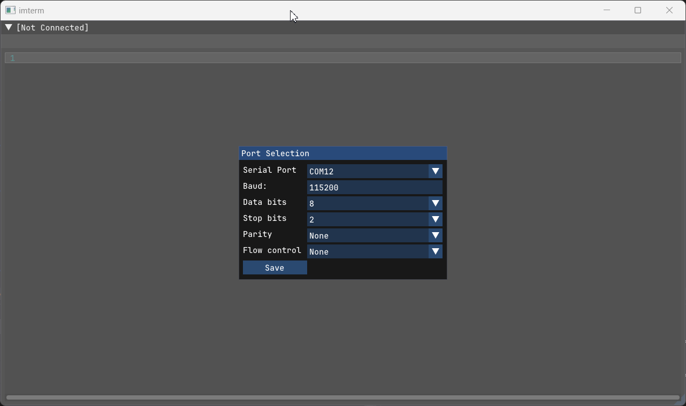

# imterm
Terminal with ANSI escape sequence support.

Serial port is the only interface currently supported. It is a major work in 
progress, a lot of cleanup and refactoring is currently needed. That being said,
it currently accomplishes my initial goal of being compatible with ESP32 console
features (line editing, coloring, history, etc.).

Future enhancements will contains features that help me develop and debug 
embedded systems, such as hexadecimal view, auto reconnect, etc.

Written in C++20 with multi-platform, hardware accelerated GUI based on [Dear ImGui](https://github.com/ocornut/imgui).
I have tested it in Windows and Linux. Mac should not be difficult to get 
working, but overall this codebase is basically untested.

Uses [conan](https://conan.io/) for all build dependencies, and CMake.

The built binary does not have any dependencies.

Submodules are still a part of the repo for `glfw` and `imgui` projects, but the 
setup of CMakeLists.txt does not currently use them. You do not need to 
initialize the submodules.

The [terminal view](src/terminal_view.h) is originally based on [ImGuiColorTextEdit](https://github.com/BalazsJako/ImGuiColorTextEdit).

The below image shows `imterm` connecting to an ESP32 C6 [console](https://github.com/espressif/esp-idf/tree/master/examples/system/console) project.
Tab completion is shown.



## Building

If you are new to [conan](https://conan.io/), you will need to get up to speed with it first.

### Install Conan

Install Conan: https://docs.conan.io/2/installation.html
```
$ pip install conan
```

### Configure Profile(s)
Generate a profile, where a C++ 20 compiler must be found:
```
conan profile detect --force
```

Run `conan profile path default` to find the location of the `default` profile.
You can save additional profiles in the same location.

#### Visual Studio
You can use create  `msvc20-release` and `msvc20-debug` profiles, e.g.:

```
[settings]
arch=x86_64
build_type=Release
compiler=msvc
compiler.cppstd=20
compiler.runtime=dynamic
compiler.version=193
os=Windows

```

```
[settings]
arch=x86_64
build_type=Debug
compiler=msvc
compiler.cppstd=20
compiler.runtime=dynamic
compiler.version=193
os=Windows
```

#### Linux

(Coming soon)

## Setup Dependent Packages & Build Presets
```
conan install . --output-folder=out/conan --build=missing --profile=msvc20-debug
```

This will install the requirements specified by [conanfile.py](conanfile.py) and 
generate `CMakeUserPresets.json` which will point to `/out/conan/build/Debug/generators/CMakePresets.json`.
This is a preset `CMake` configuration specific to your `conan` profile.

You can run this command whenever you wish, e.g., after cleaning or deleting the
output / build directory.

## CMake Configure

The result of the `conan install ...` command will tell you how you can call `CMake`.

```
conanfile.py: Preset 'conan-debug' added to CMakePresets.json. Invoke it manually using 'cmake --preset conan-debug' if using CMake>=3.23
conanfile.py: If your CMake version is not compatible with CMakePresets (<3.23) call cmake like: 'cmake <path> -G Ninja -DCMAKE_TOOLCHAIN_FILE=out\conan\build\Debug\generators\conan_toolchain.cmake -DCMAKE_POLICY_DEFAULT_CMP0091=NEW -DCMAKE_BUILD_TYPE=Debug'
```

Meaning if you have `CMake 3.23` or later you can just run:
```
cmake --preset conan-debug
```

## CMake Build
```
cmake --build out/conan/build
```

## Using `ninja` With MS VC++
If you want to force `conan` to use `Ninja` instead of `MS Build`, place 
`*:tools.cmake.cmaketoolchain:generator=Ninja` on a new line in `global.conf`
(you can find the location of `global.conf` using `conan config path`).

After running `conan install . --output-folder=out/conan --build=missing --profile=msvc20-debug`
do *not* run `cmake --preset conan-debug` as this can cause `conan` to generate a toolchain
based on `mingw` or similar.

Instead:

 1. Use `Open Folder` in Visual Studio, 
 1. `Select Startup Item -> imterm`
 1. `Project -> Configure imterm`
 1. Build / run
